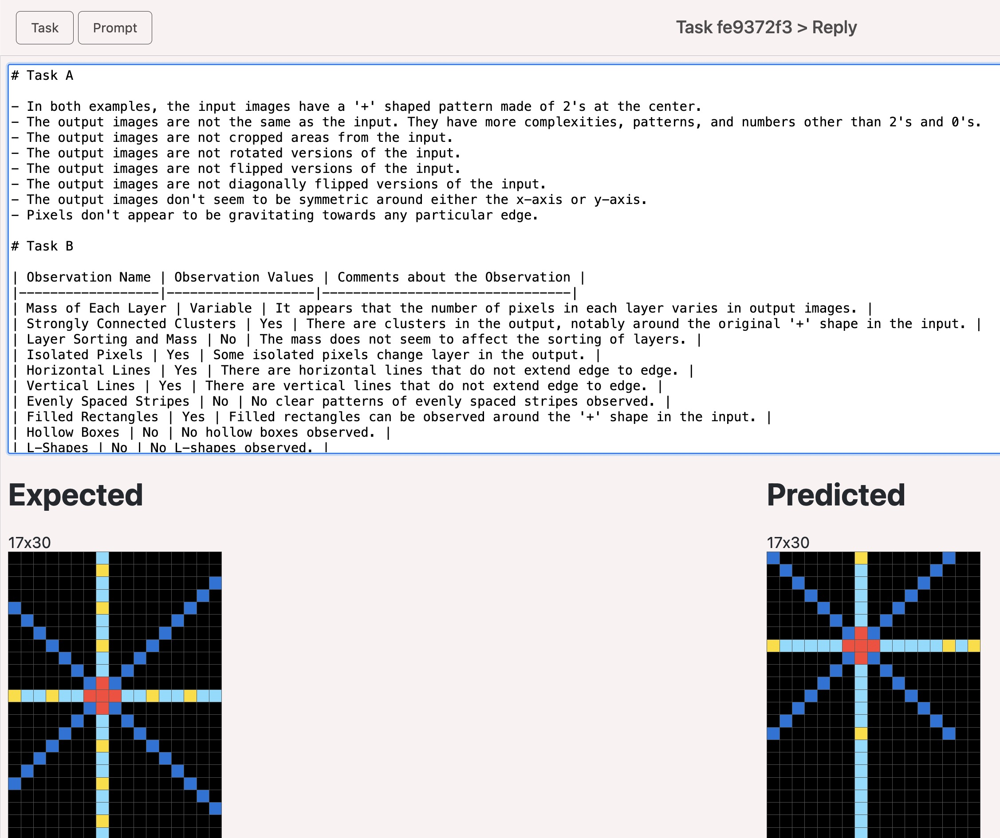
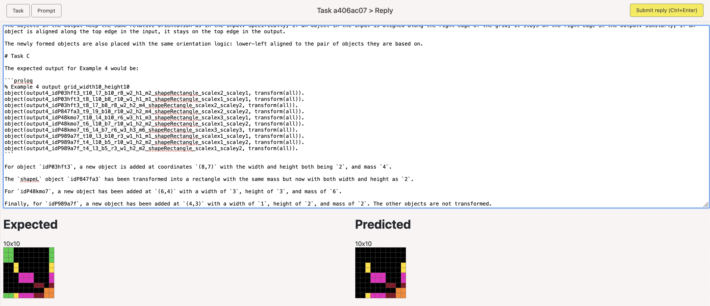
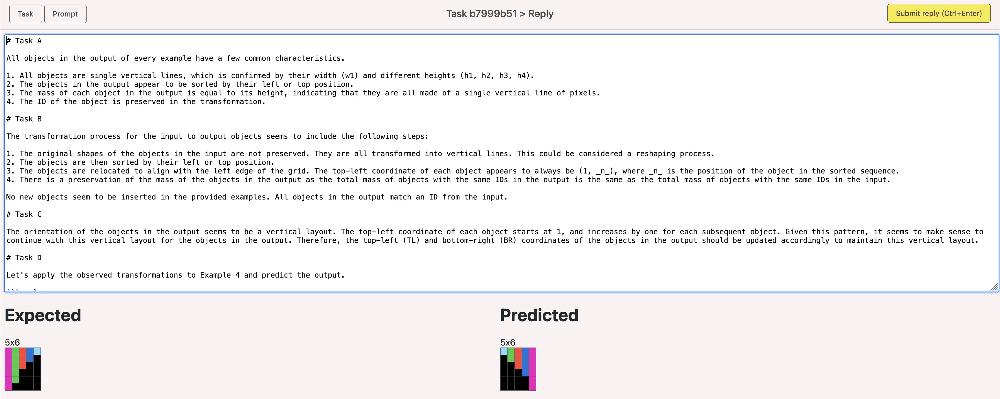
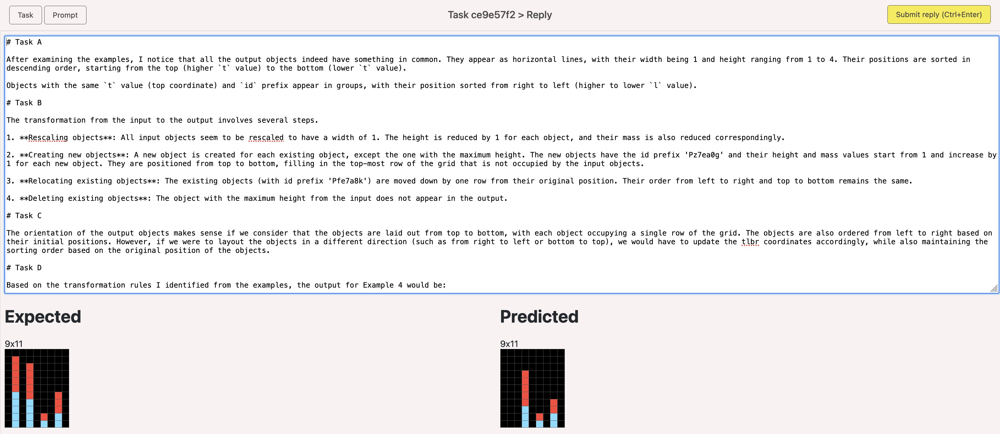
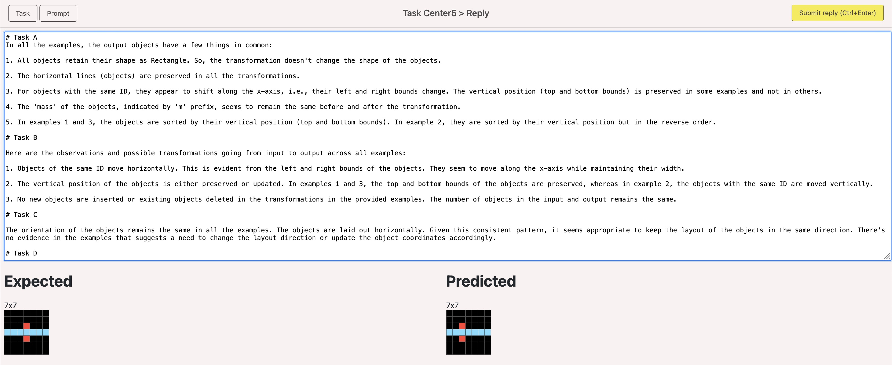
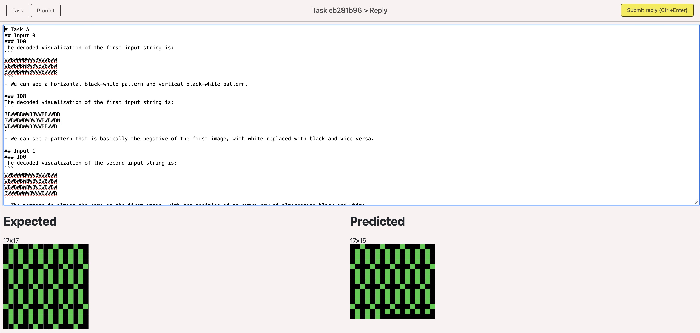

# ARC prompt collection (Abstraction and Reasoning Corpus)

Prompts for solving ARC tasks with GPT4 or similar.

Solves 42 of the public 800 tasks in the ARC 1 dataset.

Untested on the hidden 100 tasks, since GPT4 is closed source.

## Learnings about prompts

* Big prompts and low chance for a correct solution.
* Understands Run-length encoded data, but RLE harms the reasoning capabilities. However in some case RLE may work.
* Understands coordinates and can detect simple shapes, lines, boxes, tetris shapes.
* Transformations such as rotate 90 or flip, are rarely being considered correctly.
* Inconclusive what is the best way to represent colors. Sometimes raw color interger values are interpreted as math values, causing havoc to the prediction. Obfuscating colors into text helps. Instead of using the word `color`, I use the word `ID` or `Layer`. Undecided what works.

## Language models
* OpenAI's GPT4 - solves several of the ARC tasks, and the mispredictions comes very close to expected output.
* OpenAI's GPT3.5 - unable to solve ARC tasks, but sometimes the mispredictions comes close to expected output.
* Google's Bard version 2023.07.13 - wasn't able to solve any tasks.

## Examples of incorrect predictions

IMO The incorrect predictions are more interesting than the correct predictions.
These predictions gets very close to the expected output.

## Repo structure

There are 2 dirs:
- [prompts/correct](prompts/correct) - good predictions that solves the tasks.
- [prompts/incorrect](prompts/incorrect) - mispredictions that comes close at solving the tasks.

The files are markdown documents, with 3 or 4 sections.
- Section A - **metadata** about what models it was tried on. All the documents says `gpt4` at the moment.
- Section B - The **prompt**. ARC task augmented with useful info. Machine generated.
- Section C - The **reply**. The response from GPT4 or similar model.
- Section D - Optional section with **human comments** about what may have gone wrong with the reasoning.

## Discord

I hang out in the ARC channels on [Lab42](https://discord.gg/waRCYPEc6C) and [Yannic Kilcher](https://ykilcher.com/discord).
Great places for discussing prompt technique.

## License

Apache or MIT.
